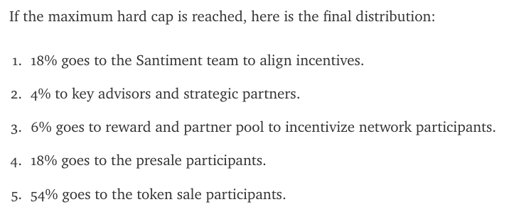

# Santiment Crowdsale Contract Audit

## Code Review

Details are in:

* [x] [Base](Base.md)
* [x] [ERC20](ERC20.md)
* [ ] [SAN](SAN.md)
* [ ] [CrowdsaleMinter](CrowdsaleMinter.md)
* [ ] [SubscriptionModule](SubscriptionModule.md)

 

### Initial Review
Comments from initial review of [9394bf3aaff84fc03c0341a5eedc59b02af95c36](https://github.com/santiment/ethereum-crowdsale/tree/9394bf3aaff84fc03c0341a5eedc59b02af95c36):

* \#1 LOW IMPORTANCE **CrowdsaleMinter** TOKEN should be lowercase as it is not a constant
* \#2 LOW IMPORTANCE **CrowdsaleMinter** Use the Owner/Owned pattern for ownership and transfer of ownership, including `acceptOwnership()` - [example](https://github.com/bokkypoobah/RAREPeperiumToken/blob/master/contracts/RareToken.sol#L11-L35)
  * Jun 25 2017 Included in **Base**
  * [ ] Some places where `only(owner)` can be replaced with `onlyOwner`
* \#3 LOW-MEDIUM IMPORTANCE **\*** `function ()` that **throw**s should be implemented to prevent ETH being accepted by the contracts - [example](https://github.com/bokkypoobah/RAREPeperiumToken/blob/master/contracts/RareToken.sol#L139-L144)
* \#4 LOW-MEDIUM IMPORANCE **\*** Allow owner to withdraw tokens accidentally sent to the contracts - [example](https://github.com/openanx/OpenANXToken/blob/master/contracts/OpenANXToken.sol#L451-L458)
* \#5 LOW IMPORTANCE **CrowdsaleMinter** `total_received_amount` -> `totalReceivedAmount`
* \#6 LOW IMPORTANCE **CrowdsaleMinter** `TOTAL_RECEIVED_ETH()` -> `totalReceivedEth()`  
* \#7 LOW IMPORTANCE **CrowdsaleMinter** `TOKEN_STARTED` -> `tokenStarted`
* \#8 LOW IMPORTANCE **CrowdsaleMinter** The long bits of logic in `validSetupOnly` should be moved into the constructor directly as it is used in only one place, making it easier to read
* \#9 LOW IMPORTANCE **CrowdsaleMinter** The states in `currentState()` is a bit complicated. It would be useful to have a state change table in the comments above the function as this is critical to the functioning of the contracts
* \#10 LOW IMPORTANCE **\*** There are some `uint24`'s in your code. It would be safer to use `uint256` generally rather than save space and this reduces the chance of type conversion errors. It may be cheaper in gas to use `uint256` as this is the native type. Keep `uint8` for `decimals` only
* \#11 LOW IMPORTANCE **CrowdsaleMinter** There are several sets of doubly declared (similar) constants. e.g. use `uint public constant COMMUNITY_PLUS_PRIORITY_SALE_CAP = 45000 ether;` as this is less confusing and reduces the chance that the incorrect version is used
* \#12 LOW IMPORTANCE **SAN** and **SubscriptionModule** `PLATFORM_FEE_PER_10000` is not a constant, should be `platformFeePer10K`
* \#13 LOW IMPORTANCE **CrowdsaleMinter** Can the use of `tx.origin` in `if (tx.origin==msg.sender) { throw; }` be removed as there are upcoming changes expected to the meaning of `tx.origin` - [reference](https://www.reddit.com/r/ethereum/comments/6d11lv/erc_about_txorigin_change_for_account_abstraction/). A possible alternative is to use `isContract(...)` from [StatusContribution](https://github.com/status-im/status-network-token/blob/master/contracts/StatusContribution.sol#L406-L416) 
* \#14 LOW IMPORTANCE **CrowdsaleMinter** `isAdmin` is so similar in function to `isOwner` and should probably be merged into `isOwner` to reduce complexity
* \#15 MEDIUM IMPORTANCE **\*** Create a script for monitoring the state of your contracts and events logged - [example](https://github.com/openanx/OpenANXToken/blob/master/scripts/getOpenANXTokenDetails.sh) and [sample output](https://github.com/openanx/OpenANXToken/blob/master/scripts/Main_20170625_015900.txt)
* \#16 LOW IMPORTANCE **\*** There are uses of both `uint` and `uint256`. Choose one and stick with it, for consistency

 

### Second Review

* \#17 LOW IMPORTANCE **SAN** and **SubscriptionModule** In the constructor, `owner` is already assigned in **Owned**
* \#18 LOW IMPORTANCE **SAN** `CROWDSALE_MINTER` should be a constant. Note that there is a Solidity compiler bug that generates a warning if you [set address variables as constant](https://github.com/ethereum/solidity/issues/2441) but the fix is not available in 0.4.11
* \#19 LOW IMPORTANCE **CrowdsaleMinter** `owner` already declared in **Owner**, and initialised in constructor
* \#20 LOW IMPORTANCE **CrowdsaleMinter** `withdrawFundsAndStartToken(...)` should use `transfer(...)` instead of `if (!owner.send(this.balance)) throw;` - [reference](https://github.com/ConsenSys/smart-contract-best-practices#be-aware-of-the-tradeoffs-between-send-transfer-and-callvalue). Same for the `send(...)` in `_sendRefund(...)`

 

### Third Review

* \#21 MEDIUM IMPORTANCE - Checking the token % calculations

  From [Santiment’s Token Sale; Everything You Need to Know in One Place!](https://medium.com/santiment/santiments-token-sale-everything-you-need-to-know-in-one-place-bf8899ec6152):

  <kbd></kbd>

  Just to use an example, say there is only one investor who puts in 100 ETH (ignore min, max cap)

  From `uint public constant TOKEN_PER_ETH = 1000;`, there will be 100,000 SAN tokens minted for the investor

  From `uint public constant TEAM_BONUS_PER_CENT = 18;` and `_mint(total_received_amount * TEAM_BONUS_PER_CENT / 100, TEAM_GROUP_WALLET);` there is 18% to the team

  From `uint public constant ADVISORS_AND_PARTNERS_PER_CENT = 10;` and `_mint(total_received_amount * ADVISORS_AND_PARTNERS_PER_CENT / 100, ADVISERS_AND_FRIENDS_WALLET);` there is 10% to advisors and partners

  team bonus = 18,000 SAN

  advisors and partners = 10,000 SAN

  Total SAN = 100,000 + 18,000 + 10,000 = 128,000

  Team bonus = 18,000 / 128,000 = **14.0625%**

  advisor and partners = 10,000 / 128,000 = **7.8125%**

  An alternative calculation:

  team bonus = 100,000 * 18% / (100%-18%-10%) = 100,000 * 18 / 72 = 25000

  advisors and partners = 100,000 * 10% / (100%-18%-10%) = 100,000 * 10 / 72 = 13888.888888888888889

  Total SAN = 100,000 + 25,000 + 13,888.8888 = 138888.888888888888889

  Team bonus = 25,000 / 138888.888888888888889 = 18%

  Advisor and partners = 13,888.8888 / 138,888.888 = 10%

  Just checking whether you are expecting 18% + 10% of the total, OR 18% + 10% ON TOP OF the total

  Also note that I have not take into account the 18% for the presale participants

 

## References

* [Ethereum Contract Security Techniques and Tips](https://github.com/ConsenSys/smart-contract-best-practices)

 

 

(c) BokkyPooBah / Bok Consulting Pty Ltd for Santiment - Jun 25 2017